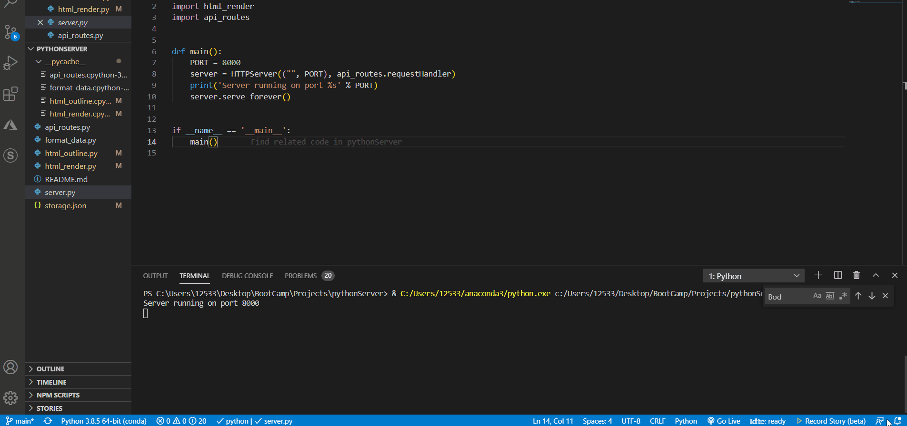

# pythonServer

## Features
* Python Server w/ HTML render (No Flask).
* Factory, Inheritance, & Proxy models.
* Dynamic HTML creation/render methods.
* CRUD with JSON data stored locally.
* Lambda and deconstruction methods.
## Future additions
* Add dynamic CSS/Bootstrap for better outcome.
* Better Interpret/Apply SPA method through changing of body elements, instead of full page rewrite.

